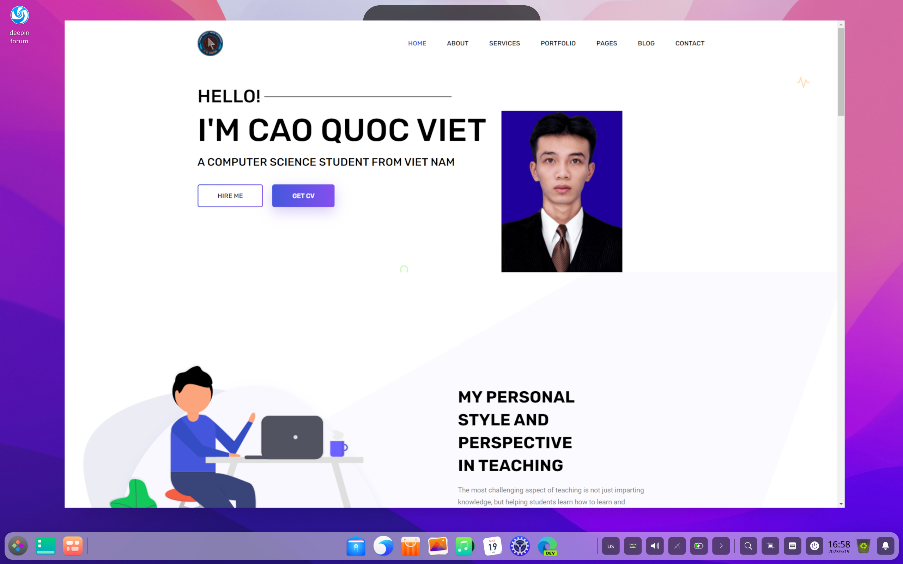

# vietcao-inf
Welcome to my personal website repository. This is where I share information about myself, my work, and my interests. The website is a simple yet effective way to introduce myself to the online world.

  

Getting Started
To explore my personal website, follow these steps:

Clone the Repository: Clone this repository to your local machine using Git or download it as a ZIP file.

Open the Website: Simply open the index.html file in a web browser to access the website.

Website Structure
The website is organized into several sections:

Home: An introduction to who I am and what I do.
About Me: A brief overview of my background, skills, and interests.
Portfolio: A showcase of my projects, accomplishments, and works.
Blog: A space where I share my thoughts, insights, and experiences.
Contact: How to get in touch with me.
Customization
Feel free to customize the website to make it your own:

Content: Replace the placeholder text and images with your own content.
Styling: Modify the CSS to change the colors, fonts, and layout.
Images: Replace the profile picture and other images with your own.
Contribution
If you're interested in contributing to my personal website, you're welcome to submit pull requests or suggestions. Let's collaborate to make it even better!

License
This project is open-source and available under the MIT License. Feel free to use, modify, and distribute it according to the terms of the license.

Contact
For any inquiries, feel free to reach out to me at vietcao10@gmail.com. I'm excited to share my personal journey and experiences with you through this website.

Thank you for visiting!

Visit My WWebsite: https://caoquocviet.github.io/vietcao-inf/
